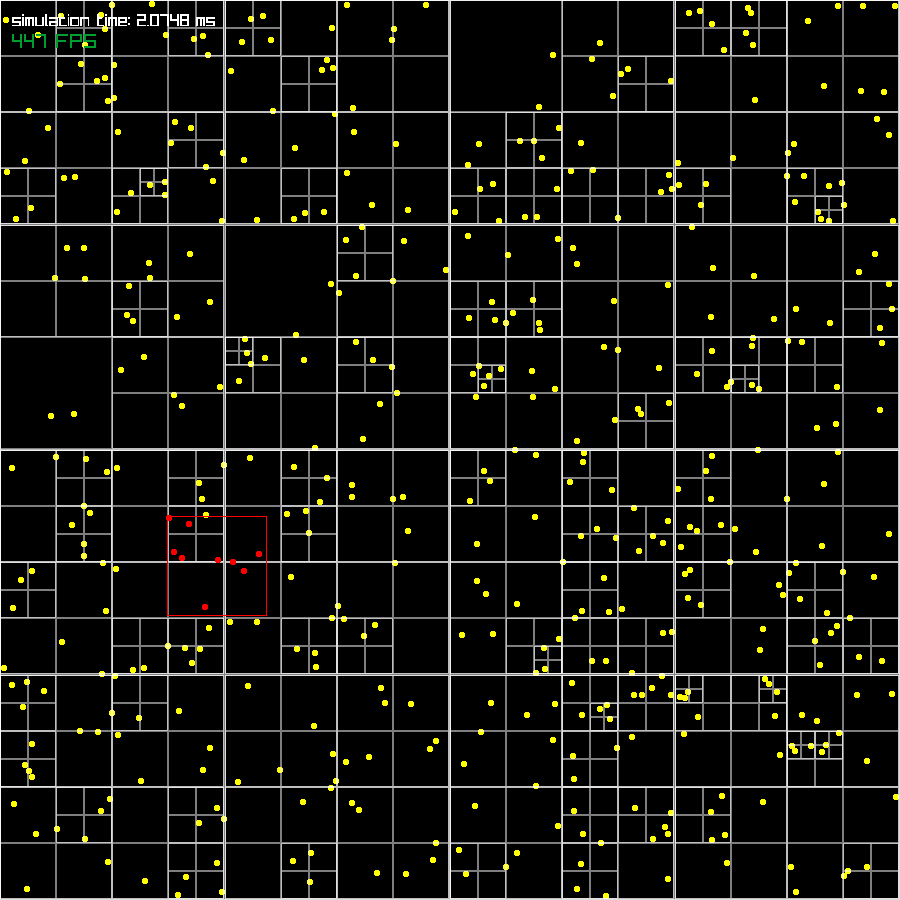

# Collisons

A small demo that simulates and visualizes collisions between balls using a quadtree data structure for efficient collision detection. The project leverages the Raylib library for rendering.

5000 balls performance test, on my machine:

- **Naive double loop**: 2 FPS
- **Quadtree**: 40 FPS



## Features

**Quadtree data structure**: A generic quadtree data structure that can be used for any 2D spatial partitioning problem

## Gettings started

### Prerequisites

- [Raylib](https://www.raylib.com/)
- [Rust](https://www.rust-lang.org/)
- [Cargo](https://doc.rust-lang.org/cargo/)

### Installation

1. Clone the repo

2. Build the project

   ```sh
   cargo build
   ```

3. Run the project

   ```sh
   cargo run
   ```
